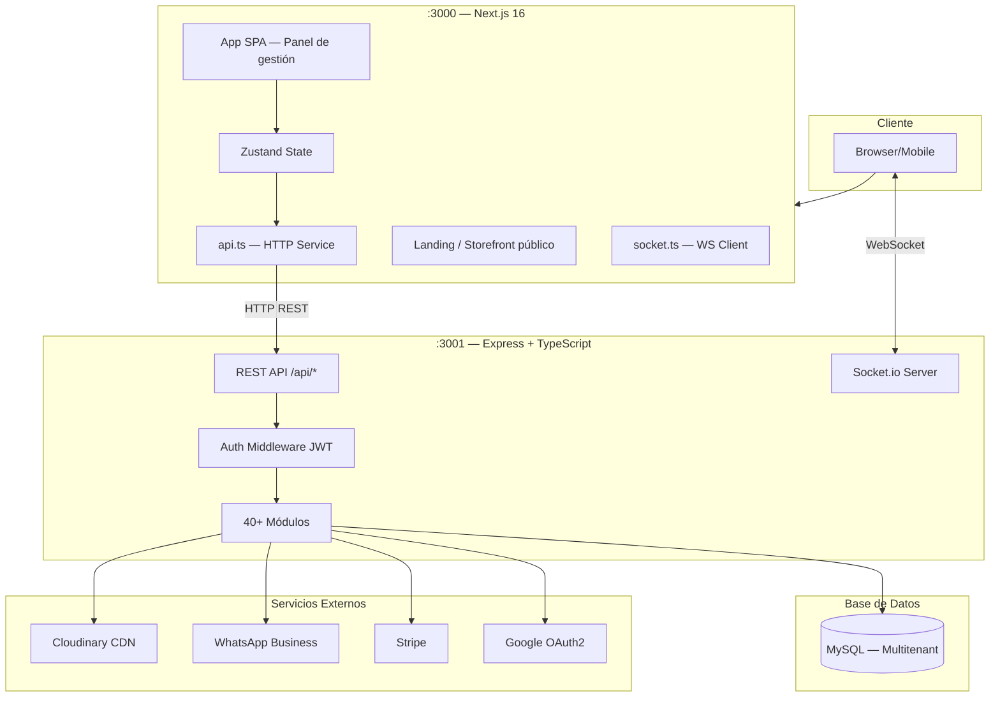

# 🗺️ Arquitectura — Vista General

## Diagrama del Sistema



## Regla de Flujo

```
UI Component
  → Zustand Action
    → api.ts (HTTP)
      → Express Route
        → Auth Middleware
          → Controller
            → Service (lógica + SQL)
              → MySQL
            ← Service
          ← Controller (JSON)
        ← Express
      ← api.ts
    ← Zustand (actualiza estado)
  ← React (re-render)
```

## Tiempo Real (Socket.io)

```
Evento en servidor (nuevo pedido, cambio de estado)
  → socket.emit('event', data)
    → todos los clientes del mismo tenant
      → frontend actualiza UI sin refresh
```

## Puertos

| Servicio | Puerto | Notas |
|---|---|---|
| Frontend Next.js | 3000 | Dev server |
| Backend Express | 3001 | `NEXT_PUBLIC_API_URL` |
| MySQL | 3306 | Local / RDS en prod |

## Ver más

- [[architecture/frontend]] — estructura detallada del frontend
- [[architecture/backend]] — estructura detallada del backend
- [[architecture/database]] — schema y convenciones DB
- [[architecture/deployment]] — entornos y deploy

---

← [[DAIMUZ]] | → [[architecture/frontend]]
