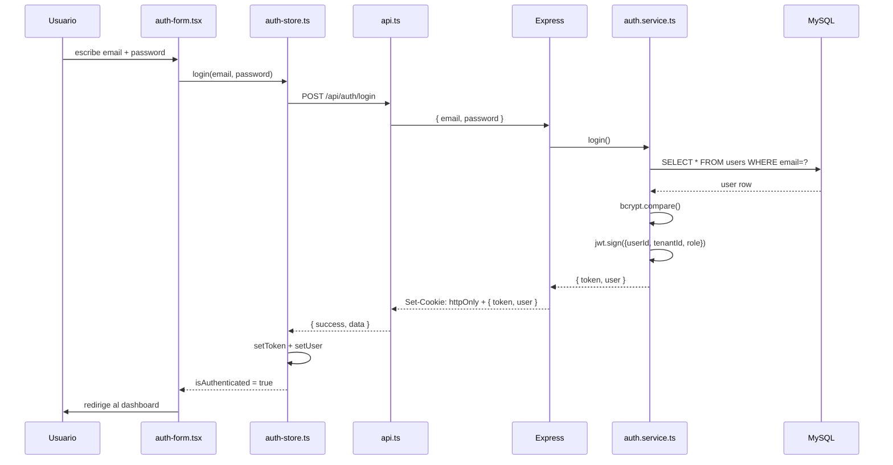

# 🔑 Flujo: Autenticación

## Login Local



## Login Google OAuth

```
1. Click "Continuar con Google"
2. Google Sign-In popup → obtiene idToken
3. POST /api/auth/google { idToken }
4. Backend verifica con Google API
5. UPSERT usuario en DB
6. Genera JWT propio
7. Mismo final que login local
```

## Protección de Rutas

```typescript
// Toda ruta protegida:
verifyToken → req.user = { userId, tenantId, role }

// Rutas por rol:
requireRole('admin')       → solo admin + superadmin
requireRole('cajero')      → cajero, admin, superadmin
```

## Token Storage

```
httpOnly Cookie ← fuente de verdad (persiste entre refreshes)
auth-store.ts   ← cache en memoria (para header Authorization)
```

**Relacionado:** [[modules/auth/auth]]

---

← [[DAIMUZ]] | → [[flows/sale-flow]]
