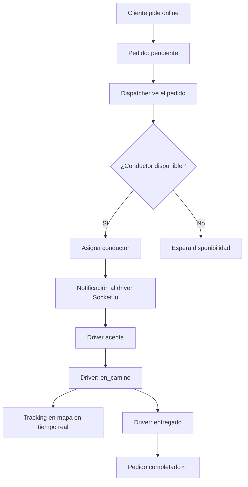

# 🚚 Flujo: Delivery Completo



## Actualizaciones en Tiempo Real

```
Driver actualiza estado/ubicación
  → PATCH /api/delivery/:id/status
  → Socket.io emite a todo el tenant:
    → 'order-status' → dispatch panel se actualiza
    → 'driver-location' → mapa se actualiza
```

## Reglas del Conductor

- Solo puede tener 1 pedido activo a la vez
- Debe estar en estado `disponible` para ser asignado
- Puede rechazar una asignación (vuelve a la cola)
- El dispatcher puede reasignar en cualquier momento

**Relacionado:** [[modules/delivery/delivery]] · [[modules/orders/orders]]

---

← [[flows/inventory-flow]] | [[DAIMUZ]]
