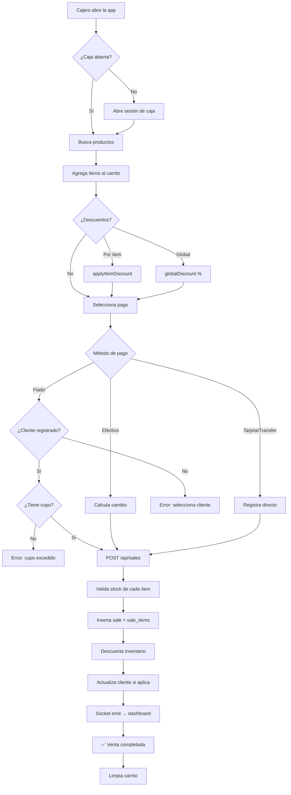

# 💸 Flujo: Venta Completa en POS

## Puntos Críticos

| Punto | Regla |
|---|---|
| Sin caja abierta | Bloquea todo |
| Stock insuficiente | Rechaza TODA la venta |
| Fiado sin cliente | No permitido |
| Cupo excedido | Bloquea crédito |

**Relacionado:** [[modules/pos/pos]] · [[modules/sales/sales]] · [[modules/inventory/inventory]]

---

← [[flows/auth-flow]] | [[DAIMUZ]] | → [[flows/order-flow]]
