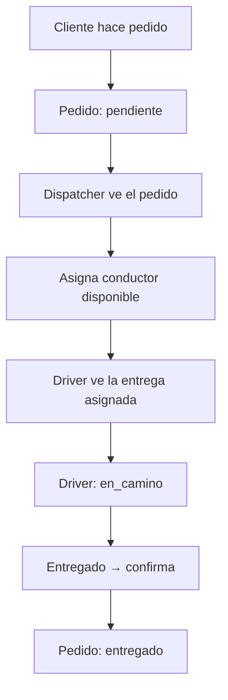

# 🚚 Módulo: Delivery

## Qué hace
Gestiona el proceso de entrega a domicilio: desde el pedido online hasta la entrega en la puerta del cliente. Incluye asignación de conductores, tracking y gestión de flota.

## Submódulos

| Submódulo | Función |
|---|---|
| `delivery` | Pedidos con delivery y estados |
| `fleet` | Vehículos y conductores |
| `dispatcher` | Panel de asignación |
| `driver` | Panel del conductor |

## Archivos

**Backend:**
- `backend/src/modules/delivery/delivery.routes.ts`
- `backend/src/modules/fleet/fleet.routes.ts`
- `backend/src/modules/vendedores/vendedores.service.ts`

**Frontend:**
- `frontend/components/dispatch-panel.tsx` — asignación de conductores
- `frontend/components/driver-panel.tsx` — panel del conductor
- `frontend/components/fleet-management.tsx` — gestión de flota
- `frontend/components/OrdersMap.tsx` — mapa en tiempo real
- `frontend/components/MiniMap.tsx` — mini-mapa embebido
- `frontend/components/LocationPicker.tsx` — selector de dirección

## Flujo de Delivery



## APIs

```
GET  /api/delivery/orders          → pedidos de delivery por estado
POST /api/delivery/assign          → { orderId, driverId }
PATCH /api/delivery/:id/status     → actualiza estado

GET  /api/fleet/vehicles           → lista vehículos
POST /api/fleet/vehicles           → agrega vehículo
GET  /api/fleet/drivers            → conductores y disponibilidad
GET  /api/fleet/tracking           → posiciones actuales (tiempo real)
```

## Tracking en Tiempo Real

```
Driver actualiza ubicación → POST /api/fleet/location { lat, lng }
Backend emite socket event → 'driver-location'
Dispatch panel y mapa se actualizan sin refresh
```

## Reglas Críticas

- Solo se puede asignar conductores con estado `disponible`
- Un conductor solo puede tener **un pedido activo** a la vez
- El dispatcher puede reasignar si el conductor no responde
- Las coordenadas de entrega se guardan para estadísticas de zona

## Dependencias
- [[modules/orders/orders]] — pedidos que requieren delivery
- [[modules/customers/customers]] — dirección del cliente
- [[modules/storefront/storefront]] — pedidos desde tienda online

---

← [[DAIMUZ]] | → [[flows/delivery-flow]]
