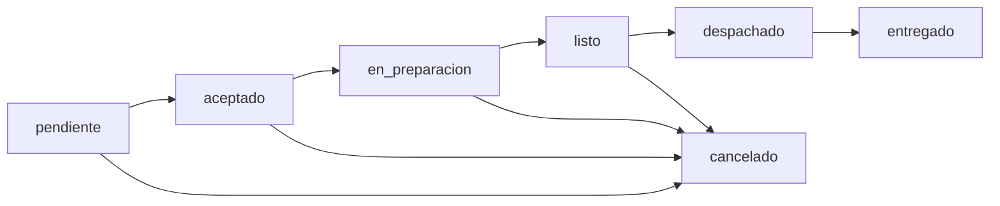

# 📋 Módulo: Orders

## Qué hace
Gestiona pedidos con estados. Cubre tanto pedidos de delivery como pedidos en mesa (restbar). Es el módulo central que conecta clientes → cocina → delivery.

## Archivos

**Backend:**
- `backend/src/modules/orders/orders.routes.ts`
- `backend/src/modules/restbar/restbar.routes.ts` — pedidos en mesa
- `backend/src/modules/restbar/restbar.service.ts`

**Frontend:**
- `frontend/components/pedidos.tsx` — gestión de pedidos
- `frontend/components/mesero-panel.tsx` — tomar pedidos en mesa
- `frontend/components/cocinero-panel.tsx` — cola de cocina
- `frontend/components/bartender-panel.tsx` — cola de barra
- `frontend/components/dispatch-panel.tsx` — asignación delivery

## Estados del Pedido



## APIs

```
GET    /api/orders                  → todos los pedidos (filtrable por estado)
GET    /api/orders/:id              → pedido con items
POST   /api/orders                  → crea pedido
PATCH  /api/orders/:id/status       → actualiza estado
DELETE /api/orders/:id              → cancela pedido

GET    /api/restbar/tables          → lista mesas
POST   /api/restbar/orders          → crea comanda en mesa
PATCH  /api/restbar/orders/:id      → actualiza comanda
```

## Tiempo Real (Socket.io)

```
Nuevo pedido creado   → emit('new-order', order) → panel cocina/bartender
Estado cambia         → emit('order-status', {id, status}) → todos los paneles
```

## Flujo de Pedido en Mesa

```
1. Mesero selecciona mesa
2. Agrega ítems al pedido (con modificaciones)
3. POST /api/restbar/orders → estado: 'pendiente'
4. Socket emite a cocina/barra
5. Cocinero/bartender ve el pedido en su panel
6. Cambia a 'en_preparacion' → 'listo'
7. Mesero ve que está listo → lleva a la mesa
8. Cierra comanda → genera venta
```

## Reglas Críticas

- Un pedido cancelado no puede modificarse
- Solo `admin` y `dispatcher` pueden reasignar conductores
- El cambio de estado es unidireccional (no se puede "retroceder")
- Los pedidos cancelados quedan en auditoría con razón

## Dependencias
- [[modules/inventory/inventory]] — valida stock
- [[modules/delivery/delivery]] — si es con delivery
- [[modules/customers/customers]] — cliente del pedido
- [[flows/order-flow]] — flujo completo

---

← [[DAIMUZ]] | → [[flows/order-flow]]
